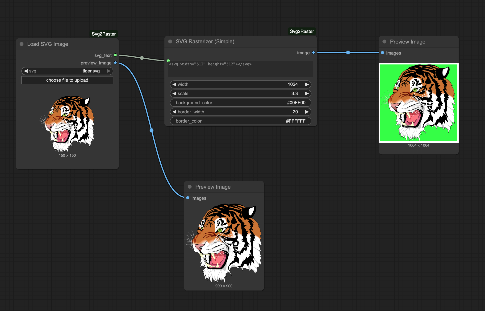

# ComfyUI-Svg2Raster

This is a simple and efficitent [ComfyUI](https://www.comfy.org/) node to load SVG files and rasterize them into images that can be used in your workflows. 


## Updates

**2025-09-10**:
- First release of the `ComfyUI-Svg2Raster` node.
- Added two nodes: `Load SVG Image` and `SVG Rasterizer (Simple)`.

## Installation

> [!IMPORTANT]
> This package uses `CairoSVG` for SVG loading and manipulation, which requires `Cairo` to be installed as a system dependency. Please follow the instructions for your operating system to install it before proceeding.
> - [CairoSVG Documentation](https://cairosvg.org/documentation/)
> - [Cairo Graphics Download](https://www.cairographics.org/download/)

After installing [Cairo](https://cairosvg.org/):

1. Navigate to the `ComfyUI/custom_nodes/` directory.
2. Clone this repository:
   ```bash
   git clone https://github.com/garg-aayush/ComfyUI-Svg2Raster.git
   ```
3. Install the required dependencies:
   ```bash
   pip install -r requirements.txt
   ```
4. Restart ComfyUI.


## Features

This package includes two main nodes to handle SVG images in your workflows:

1. `Load SVG Image`: This node is used to import or load an SVG file. It outputs the SVG content as a text string and also provides a rasterized preview image that can be directly used in your workflow.

2. `SVG Rasterizer (Simple)`: This node takes SVG text (for example, from the `Load SVG Image` node) and rasterizes it into an image with various customization options.

    **Parameters:**
    - `svg_text`: The SVG content as a string.
    - `width`: The desired output width in pixels. Overrides `scale` if set.
    - `scale`: A scaling factor for the SVG. Used only if `width` is 0.
    - `background_color`: The background color in hex format or 'transparent'.
    - `border_width`: The width of the border in pixels.
    - `border_color`: The color of the border in hex format or 'transparent'.
